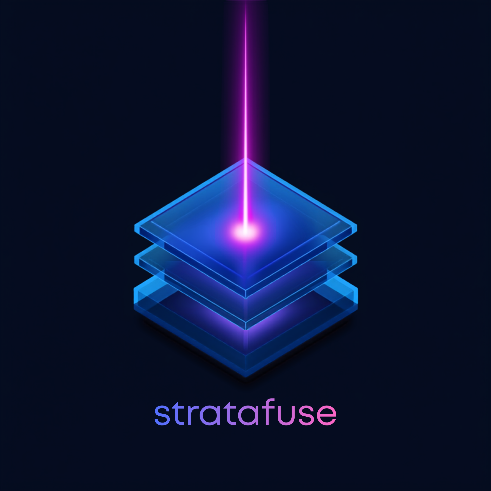
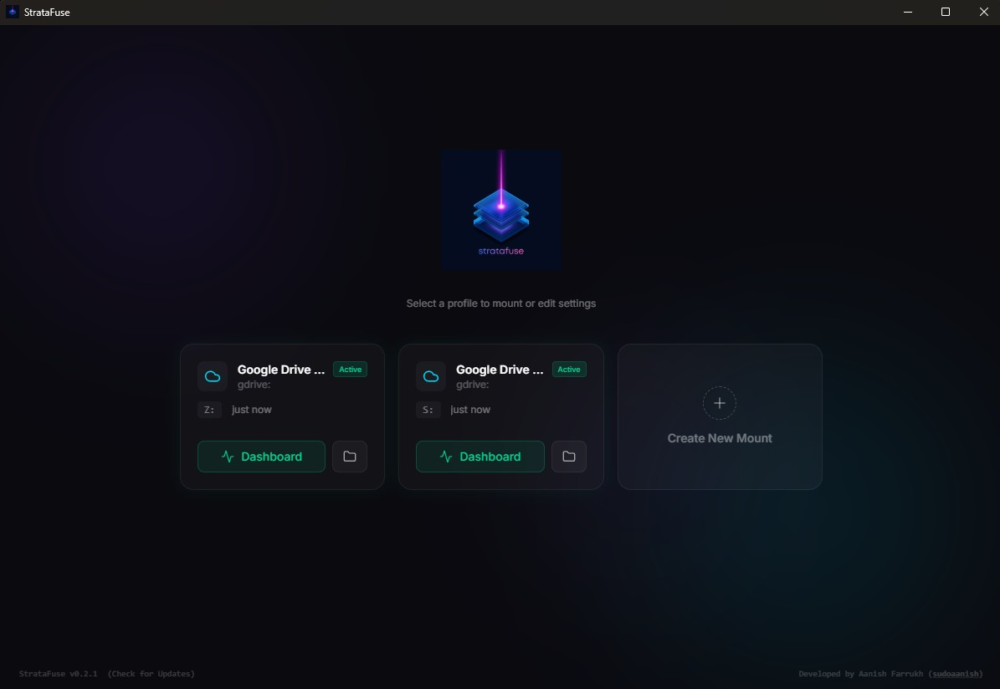
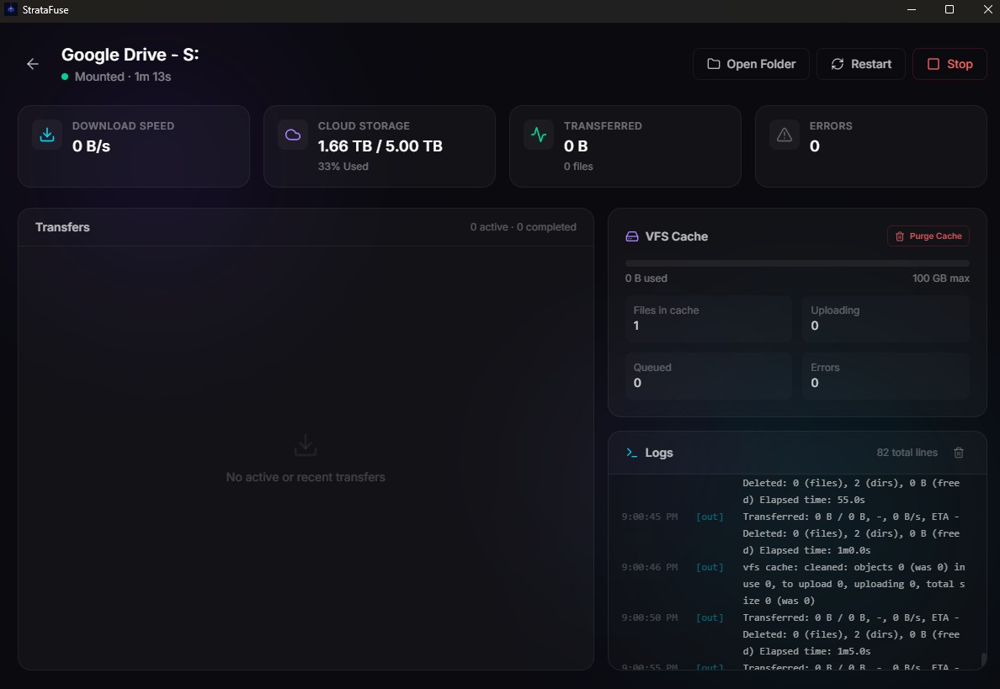
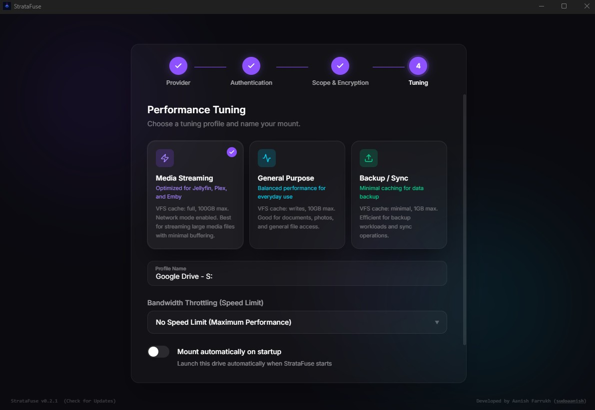

<div align="center">



# StrataFuse

### A desktop cloud-mounting client for turning rclone remotes into native local drives.

StrataFuse wraps [rclone](https://rclone.org/) in a polished desktop interface for mounting cloud storage as local drives, managing VFS cache profiles, monitoring active transfers, and controlling mounts from a native system tray experience.

<p>
  <a href="https://github.com/sudoaanish/StrataFuse/releases/latest">
    
  </a>
  <a href="https://github.com/sudoaanish/StrataFuse/releases">
    
  </a>
  <a href="https://github.com/sudoaanish/StrataFuse/blob/main/LICENSE">
    
  </a>
</p>

<p>
  
  
  
</p>

<p>
  <a href="#preview">Preview</a> ·
  <a href="#key-features">Features</a> ·
  <a href="#installation--setup-guide">Install</a> ·
  <a href="#developer-guide">Developer Guide</a> ·
  <a href="#google-cloud-platform-gcp-oauth-setup-guide">Google Drive Setup</a>
</p>

</div>

---

## Preview

<p align="center">
  
</p>

StrataFuse provides a desktop interface for managing cloud-backed rclone mounts, including profile-based setup, active mount dashboards, VFS cache controls, performance tuning, logs, and local drive access.

## Screenshots

| Active Mount Dashboard | Performance Tuning |
|---|---|
|  |  |

---

## Why StrataFuse?

rclone is powerful, but everyday desktop use often requires remembering command-line flags, cache modes, mount options, provider quirks, and platform-specific setup steps.

StrataFuse turns that workflow into a native desktop product.

It is designed for people who want cloud storage to behave like a local drive while still having control over cache behavior, mount profiles, startup behavior, encryption, logs, and performance settings.

---

## Built For

- Jellyfin, Plex, Emby, and VLC media libraries
- Cloud archive and backup workflows
- Multi-cloud storage setups
- Users who want rclone power without living in the terminal
- Desktop users who want mount status, logs, tray controls, and cache management in one place

---

## Key Features

* **Multi-Provider Cloud Mounting:** Mount Google Drive, Microsoft OneDrive, Dropbox, Amazon S3, Proton Drive, and other rclone-supported backends as local drives.
* **VFS Cache Tuning Presets:** Choose optimized virtual file system configurations for common workflows:
  * **Media Streaming:** Full VFS file cache, 100GB maximum limit, and network settings tailored for Jellyfin, Plex, Emby, and VLC streaming.
  * **General Purpose:** Write-cached files with a 10GB limit for daily office work, documents, photos, and general file operations.
  * **Backup / Sync:** Minimal 1GB cache mode optimized for raw backup and sync workloads.
* **VFS Cache Purging:** Clear local cached file chunks directly from the dashboard to recover local storage.
* **Bandwidth Throttling / Speed Limits:** Dynamically select speed limits such as No Limit, 10MB/s, 5MB/s, 2MB/s, or 1MB/s inside the setup wizard.
* **Cloud Storage Utilization Gauge:** View remote storage usage, used capacity, and available capacity.
* **Dynamic System Tray Controls:** Control mount profiles directly from the taskbar system tray menu without opening the full GUI.
* **Open in Explorer Integration:** Open active mount drive letters such as `Z:\` or `S:\` directly in Windows Explorer.
* **Startup Autostart:** Launch minimized to the system tray on Windows startup and automatically mount selected profiles.
* **Zero-Knowledge Encryption:** Use rclone crypt to encrypt files locally before uploading them to public cloud providers.
* **Live Performance Monitoring:** View active download speeds, transferred sizes, cache status, errors, and live logs inside the dashboard.

---

## Tech Stack

<p>
  
  
  
  
  
</p>

StrataFuse is built with:

- **Tauri** for the native desktop shell
- **Rust** for backend/native integration
- **React** for the user interface
- **TypeScript** for frontend application logic
- **rclone** as the cloud-storage and mount engine

---

## Installation & Setup Guide

### Which Asset Should You Download?

When visiting the **[Releases](https://github.com/sudoaanish/StrataFuse/releases)** page on GitHub, download the package matching your operating system and user preference:

| Operating System | Recommended Download | Best For |
| :--- | :--- | :--- |
| **Windows 10/11** | `StrataFuse_x.x.x_x64-setup.exe` | **Recommended.** Lightweight, standard setup wizard. Installable without administrator rights. |
| **Windows 10/11** | `StrataFuse_x.x.x_x64_en-US.msi` | Standard MSI installer package. Best for enterprise deployments. |
| **macOS Intel/Apple Silicon** | `StrataFuse_x.x.x_universal.dmg` | **Recommended.** Drag-and-drop installer volume that runs on both Intel and Apple Silicon Macs natively. |
| **Linux Ubuntu/Debian** | `StrataFuse_0.2.1_amd64.deb` | Debian installer package. Best for Ubuntu, Debian, Mint, etc. |
| **Linux Fedora/CentOS** | `StrataFuse-0.2.1-1.x86_64.rpm` | Red Hat Package Manager format. Best for Fedora, CentOS, RHEL, etc. |
| **Linux Any Distro** | `StrataFuse_0.2.1_amd64.AppImage` | Standalone portable executable. Runs on most distributions without installation. |

> [!NOTE]
> The `.sig` files uploaded alongside installers are cryptographic signatures. They are used by the in-app auto-updater to verify installer integrity and block tampering or man-in-the-middle attacks. You do not need to download them manually.

---

### Step-by-Step Installation Guides

#### Installing on Windows

1. Download `StrataFuse_0.2.1_x64-setup.exe` from the [Releases](https://github.com/sudoaanish/StrataFuse/releases) page.
2. Double-click the downloaded setup file to launch the installer wizard.
3. Follow the prompts to finish the installation.
4. Launch **StrataFuse** from your Desktop shortcut or the Start Menu.
5. If you are configuring a Google Drive mount, go to the [Google Cloud Platform OAuth Setup Guide](#google-cloud-platform-gcp-oauth-setup-guide) below to set up your API credentials.

#### Installing on macOS

StrataFuse releases on macOS are unsigned Universal DMGs. To bypass macOS Gatekeeper warning screens:

1. Download `StrataFuse_0.2.1_universal.dmg` from the [Releases](https://github.com/sudoaanish/StrataFuse/releases) page.
2. Double-click the `.dmg` file to open it, then drag the **StrataFuse** icon into your **Applications** folder.
3. Open your **Applications** folder, right-click or control-click **StrataFuse**, and select **Open**.
4. A warning dialog will appear saying the developer cannot be verified. Click **Open**, or go to **System Settings > Privacy & Security** and click **Open Anyway** under the security section.

You only need to do this once.

#### Installing on Linux

**Via AppImage**

1. Download `StrataFuse_0.2.1_amd64.AppImage`.
2. Right-click the downloaded file, go to **Properties > Permissions**, and check **Allow executing file as program**.

Alternatively, run:

```bash
chmod +x StrataFuse_0.2.1_amd64.AppImage
```

Then double-click to run.

**Via DEB**

1. Download `StrataFuse_0.2.1_amd64.deb`.
2. Open your terminal and run:

```bash
sudo apt install ./StrataFuse_0.2.1_amd64.deb
```

3. Launch StrataFuse from your desktop application menu.

---

## Developer Guide

### Prerequisites

* [Node.js](https://nodejs.org/) v18 or higher recommended
* [Rust and Cargo](https://rustup.rs/)
* C++ build tools:
  * MSVC Build Tools on Windows
  * Xcode Command Line Tools on macOS
  * `build-essential` or equivalent on Linux

### Installation

Clone the repository:

```bash
git clone https://github.com/sudoaanish/StrataFuse.git
cd StrataFuse
```

Install package dependencies:

```bash
npm install
```

On `npm install`, a postinstall setup script at `scripts/setup-rclone.js` automatically detects your host operating system and CPU architecture, downloads the official corresponding rclone binary, and registers it as a sidecar binary inside `src-tauri/binaries/`.

### Development Commands

Run the frontend development server:

```bash
npm run dev
```

In a separate terminal, run the Tauri development app:

```bash
npm run tauri dev
```

Build and package the production installers:

```bash
npm run tauri build
```

---

## Google Cloud Platform GCP OAuth Setup Guide

To mount Google Drive without hitting API rate limits or experiencing `403 Rate Limit Exceeded` errors under heavy usage, you should configure your own **Google Client ID** and **Google Client Secret**.

Using Google's default shared credentials can result in slower response times and API throttle blocks.

Follow these steps to create your own GCP API credentials.

### 1. Create a Google Cloud Project

1. Go to the [Google Cloud Console](https://console.cloud.google.com/).
2. Log in with your Google Account.
3. Click the project dropdown in the top-left corner and click **New Project**.
4. Name the project, for example `StrataFuse Drive Mount`.
5. Click **Create**.

### 2. Enable the Google Drive API

1. In the search bar at the top, search for **Google Drive API**.
2. Select the API from the search results.
3. Click **Enable**.

### 3. Configure the OAuth Consent Screen

1. In the left navigation sidebar, click **APIs & Services > OAuth consent screen**.
2. Select **External** as the user type.
3. Click **Create**.
4. Fill in the required fields:
   * **App name:** `StrataFuse`
   * **User support email:** Select your Gmail address.
   * **Developer contact information:** Enter your email address.
5. Click **Save and Continue**.
6. Under **Scopes**, click **Save and Continue**. You can leave this blank/default because rclone requests the necessary Google Drive permissions dynamically at runtime.
7. Under **Test users**, click **Add Users** and add your own Google email address.
8. Click **Save and Continue** to finish.

> [!IMPORTANT]
> While your GCP project is in testing mode, only designated test users can complete the OAuth authentication process.

### 4. Create OAuth Client ID Credentials

1. In the left sidebar, click **Credentials**.
2. Click **Create Credentials**.
3. Select **OAuth client ID**.
4. Under **Application type**, select **Desktop app**.
5. Set the name, for example `StrataFuse Desktop Client`.
6. Click **Create**.
7. Copy the displayed **Client ID** and **Client Secret**.
8. Paste them into the StrataFuse setup wizard when configuring a Google Drive profile.

> [!IMPORTANT]
> Do not choose **Web application** for the OAuth client type. The Desktop app type allows rclone to use loopback authentication dynamically.

---

## Roadmap

Planned or possible next improvements:

- Mount health detection and one-click repair
- Diagnostic bundle export for easier troubleshooting
- Better first-run setup flow
- More detailed provider-specific setup guidance
- Dedicated Jellyfin/Plex media-library preset
- Improved Linux desktop integration
- Signed macOS and Windows releases

---

## License

This project is licensed under the MIT License. See the [LICENSE](LICENSE) file for details.

---

## Author

Created and developed by **Aanish Farrukh**.

<p>
  <a href="https://github.com/sudoaanish">
    
  </a>
  <a href="http://aanishfarrukh.com/">
    
  </a>
</p>
